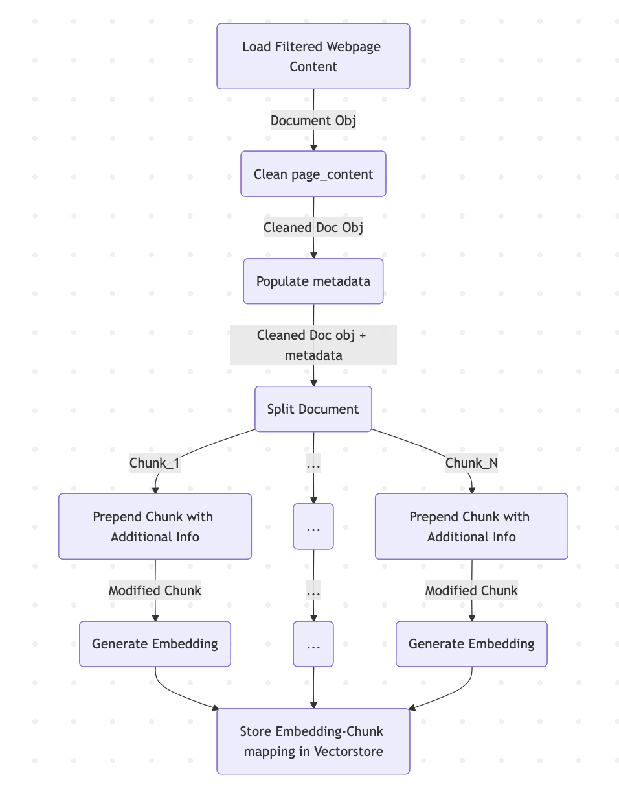

# Data Indexing and Knowledge Base Setup

This directory contains the implementation of the document indexing and knowledge base setup process for the Canvas Assistant chatbot. The primary artifact is `00-indexing.ipynb`, which implements an Indexing class and the end-to-end pipeline that converts raw web content into a persistent vector search index.

## Overview

Indexing converts authoritative Canvas documentation (and other web sources) into a vectorized knowledge base used by the chatbot for retrieval. The pipeline covers four high-level stages: web ingestion, pre-processing/cleaning, chunking and metadata enrichment, and embedding + storage. Each stage is intentionally designed to improve retrieval quality and to influence how each chunk sits in embedding space: the pipeline actively attempts to bring semantically related chunks closer together (for example, fragments from the same guide remain nearby in vector space even after the guide is broken into multiple chunks). To help achieve this, the implementation appends compact provenance and topic hints — such as the document title, source, and guide type — to each chunk's stored content/metadata so the embedding model receives additional contextual signals that encourage grouping of related chunks while preserving traceability.

## The Indexing class (documented in `00-indexing.ipynb`)

The notebooks implement an `Indexing` (or similarly named) class whose responsibilities are:

- Orchestrate web ingestion from a list of URLs.
- Apply HTML/content filtering to focus on the article/content area rather than navigation, sidebars, or boilerplate.
- Run document pre-processing
- Split cleaned pages into semantically useful chunks with controlled overlap.
- Generate embeddings for chunks and persist them to the vector store (Chroma) along with metadata.

## Embedding inspection and visualization

**Highlight**: performed a brief embedding-quality inspection using Nomic Atlas to visualize clusters and spot-check nearest neighbours. This was a lightweight check; a lot more can be done later. It was intresting to see how the documents we positioned in the vector space and if relevant document were placed close together, which indicates embedding quality.

## Outputs

After a successful run you should expect:

- A persistent Chroma vector store directory (under `../data/chroma_knowledge_base`) containing embeddings and metadata.
