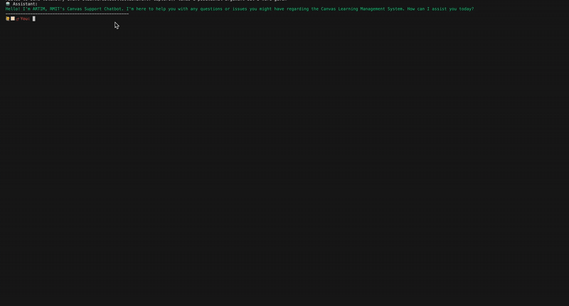
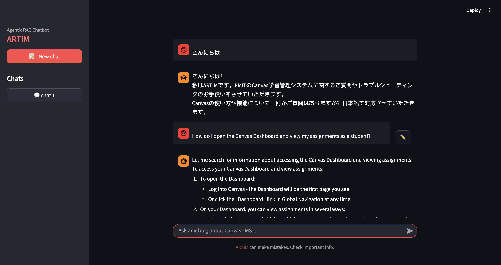
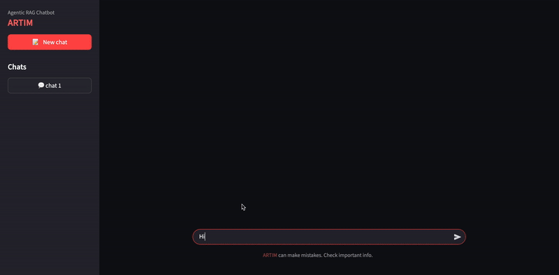

# ARTIM: An AI-Powered Canvas LMS Assistant

## Overview

ARTIM is an AI-powered helper designed to assist students with [Canvas LMS](https://www.instructure.com/en-au/canvas) navigation and troubleshooting. Inspired by RMIT's GenAI tool "Val" and its Course Assist persona, this project demonstrates the practical implementation of advanced RAG (Retrieval-Augmented Generation) techniques in an educational context. This project was made during my study at RMIT as part of DCNC 2025 Community startup project "AI-assisted supporter".

## Project Aims

- Create an intelligent assistant to help students navigate Canvas LMS effectively
- Implement and evaluate various RAG techniques in a real-world application

## Technical Implementation

- **Backend**: Python-based implementation using LangChain/LangGraph and Claude on Amazon Bedrock
- **Frontend**: Streamlit interface for user interaction
- **Knowledge Base**: Curated content from Canvas documentation, including student guides, troubleshooting guides, and basic tutorials etc..

## Project Highlights

- Battle Tested Chatbot: Evaluation driven development with the use of deepeval:
  - generated synthetic dataset based on knowledge base.
  - tested and improved initial implementations.

## Working Stills

### MVP



## ARTIM





## Key Learnings

- During the project I have had the opportunity to deep dive into various open-source libaries includeing langchain, langgraph and deepeval. This was necessary to understand the implementation details at times when the documentation was as comprehensive. Mid project LangChain released v1.0 which brought a lot of changes, reading the source code of langchain as well as it's integrations as pivotal in my learning process. While daunting at start, I ended up with a more comprehensive understanding of the internal workings than reading a documentation would have given.

- Working with low-lvl APIs vs High-lvl abstractions (LangChain): During the development I worked interacting with anthropic models using both boto3/ bedrock (low-lvl) implementation as well as High-lvl abstractions provided by LangChain. While starting with LangChain is easier to get started with development GenAI and Agentic AI Applications, I was able to explore the greater level of control working with low level implementations, at times favouring them over LangChain. At the time of initial development, LangChain's AWS Bedrock was yet to reach feature parity, so the MVP was implemented using boto3/ bedrock. LangChain/ LangGraph was only fovoured in the final product due to the rich features/ complete package it has to offer.

- Having worked predominatly predominantly OPENAI chat models through LangChain, this project gave me the opportunity to work with Anthropic's Claude, specificially `claude-3-haiku` and `claude-3.5-sonnet` which bring their own interesting features.

- Working with Ollama and Hugging Local Models

- Evaluation with deepeval

## Project Structure & Documentation

Each subdirectory contains comprehensive README.md files that provide detailed documentation:

- `01-rag-techniques/`: Step-by-step guide through various RAG implementation techniques
- `02-playground/`: Experimental implementations and testing ground
- `03-agentic-rag-chatbot-development/`: Complete development lifecycle documentation including:
  - Data indexing and knowledge base setup
  - Synthetic data generation process
  - Retrieval and generation evaluation
  - MVP development and testing
  - Final product implementation

## Setup Instructions

### Environment Configuration

Create a `.env` file in the root directory with the following configurations:

```env
# OpenAI Configuration (OPTIONAL)
OPENAI_API_KEY="<OPENAI-API-KEY>"

# AWS Configurations (REQUIRED)
COGNITO_REGION="<REGION>"
BEDROCK_REGION="<REGION>"
MODEL_ID1="<MODEL_ID1>"
MODEL_ID2="<MODEL_ID2>"
USER_POOL_ID="<USER_POOL_ID>"
APP_CLIENT_ID="<APP_CLIENT_ID>"

# Authentication (REQUIRED)
USERNAME="<STUDENT_ID>@student.rmit.edu.au"
PASSWORD="PASSWORD"

# Additional Services (OPTIONAL)
NOMIC="nomic-api-key"

# LangSmith Configuration (for debugging and monitoring) (OPTIONAL)
LANGSMITH_TRACING="true"
LANGSMITH_ENDPOINT="https://api.smith.langchain.com"
LANGSMITH_API_KEY="LANGSMITH_API_KEY"
LANGSMITH_PROJECT="<PROJECT_NAME>"
```

These environment variables are required for:

- AWS Bedrock model access
- Authentication and authorization
- Embedding visualization (Nomic)
- LangSmith monitoring and debugging

### System Requirements

**Ollama Setup (Required)**:

1. Install Ollama from [https://ollama.com](https://ollama.com)
2. Pull the required embedding model:
   ```bash
   ollama pull bge-m3
   ```
   - **IMPORTANT**: make sure ollama is running in the background
   - The project is configured to use `bge-m3` which produces **1024-dimensional embeddings**
   - If using a different embedding model, ensure it produces 1024-dimensional embeddings for compatibility with the existing vector stores

**Local Huggingface models Setup (Optional)**:

- Some of the exploratory notebooks use local hugging face models, please make sure they are available on your system if you choose to run the notebooks yourself. The use of LangChain gives us the abiltiy to plug n play a lot of components, so feel free to use your own preferred components.

## Start Guide

The system comes pre-configured with an indexed knowledge base and is ready to use. 

To get started:

0. Create a new virtual environment `conda create -p venv pyhton=3.12 -y` & `conda activate <PROJECT_DIR>/venv`
2. Create `.env` file with required credentials in the <PROJECT_DIR> (see Environment Configuration section)
3. Install initial dependency: `pip3 install ipykernel`
4. Run `installing_requirements.ipynb` to set up all dependencies
1. Navigate to `03-agentic-rag-chatbot-development/05-final-product/`
5. Launch the application using the instructions in the final product directory

The repository includes all necessary components.

### Dependencies Installation

**Important**: Due to LangChain v1.0 release mid-project and specific version requirements for local models (particularly torch requiring older numpy versions), there are potential dependency conflicts to be aware of.

To avoid dependency issues:

1. DO NOT use `pip install -r requirements.txt`
2. Instead, use the provided `installing_requirements.ipynb` notebook which installs dependencies incrementally in a tested order:
   - Core Python dependencies
   - LangChain ecosystem packages
   - Machine learning libraries (with specific version constraints)
   - Vector stores and embeddings
   - AWS and UI components

## Useful Sources

- https://python.langchain.com/api_reference/index.html
- https://reference.langchain.com/python/langgraph/
- https://docs.langchain.com/
- https://huggingface.co/blog/matryoshka
- https://huggingface.co/sentence-transformers/all-mpnet-base-v2
- https://www.w3schools.com/python/python_regex.asp
- https://docs.langchain.com/oss/python/integrations/chat/ollama
- https://github.com/langchain-ai/langchain-community
- https://github.com/langchain-ai/langchain
- https://github.com/langchain-ai/langchain-aws/tree/main
- https://docs.claude.com/en/api/claude-on-amazon-bedrock
- https://docs.claude.com/en/api/overview
- https://github.com/anthropics/claude-cookbooks
- https://ollama.com/library/embeddinggemma
- https://ai.google.dev/gemma/docs/embeddinggemma
- https://huggingface.co/google/embeddinggemma-300m
- https://docs.aws.amazon.com/pdfs/bedrock/latest/userguide/bedrock-ug.pdf
- https://deepeval.com/docs/getting-started
- https://docs.aws.amazon.com/bedrock/latest/APIReference/API_agent-runtime_TextInferenceConfig.html
- https://docs.streamlit.io/
- https://arxiv.org/pdf/2407.01219

## Bugs

- The Application can still be broken in various ways are is yet to be fixed. e.g. Chainging chat mid token streaming, Giving user input during token generation, ~~newer versions of streamlit produces ghost widgets (can be fixed with downgrading package but this also leads to other issues)~~ etc..
